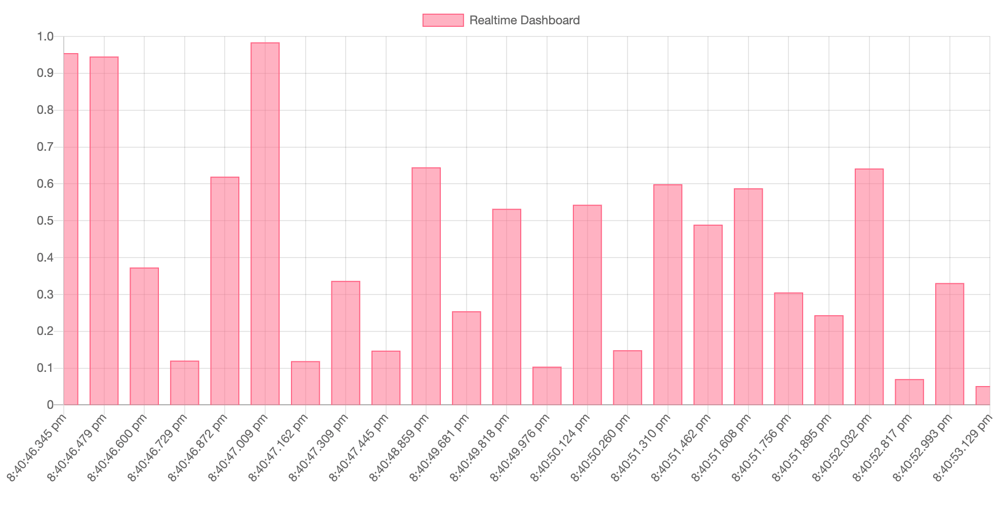

# example-realtime-dashboard

Project with frontend (chart) and backend. Communication was based on WebSockets.



## Installation guide

```bash
git clone git@github.com:piecioshka/example-realtime-dashboard.git
cd example-realtime-dashboard
npm install
npm run start:backend
npm run start:frontend
```

## 🤝 Contributing

Contributions, issues and feature requests are welcome!<br />
Feel free to check [issues page](https://github.com/piecioshka/example-realtime-dashboard/issues/).

## Show your support

Give a ⭐️ if this project helped you!

## License

[The MIT License](http://piecioshka.mit-license.org) @ 2021
